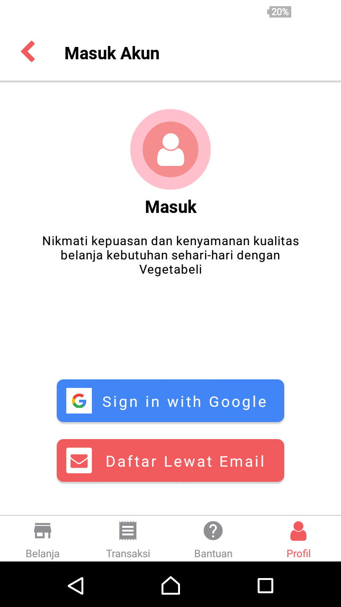
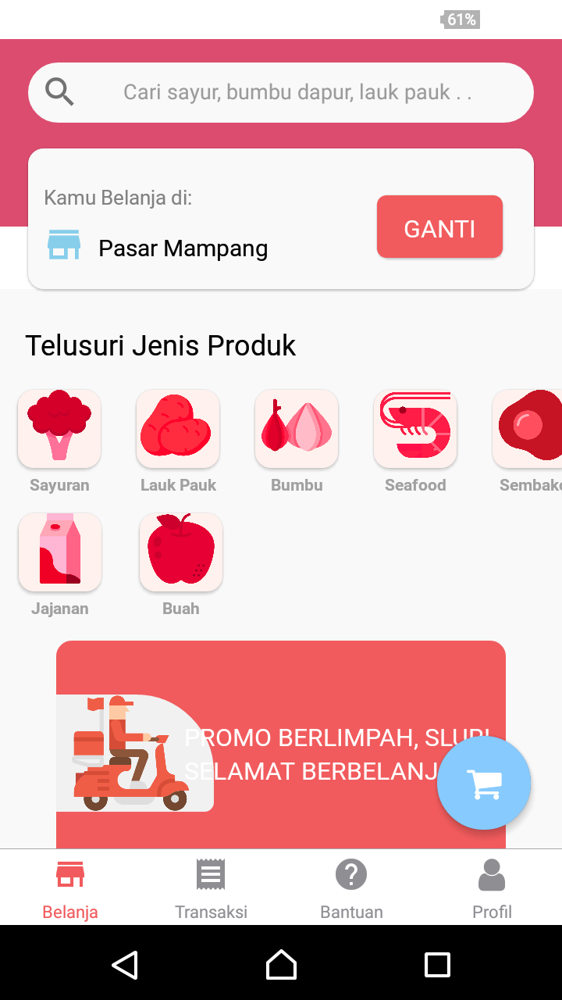
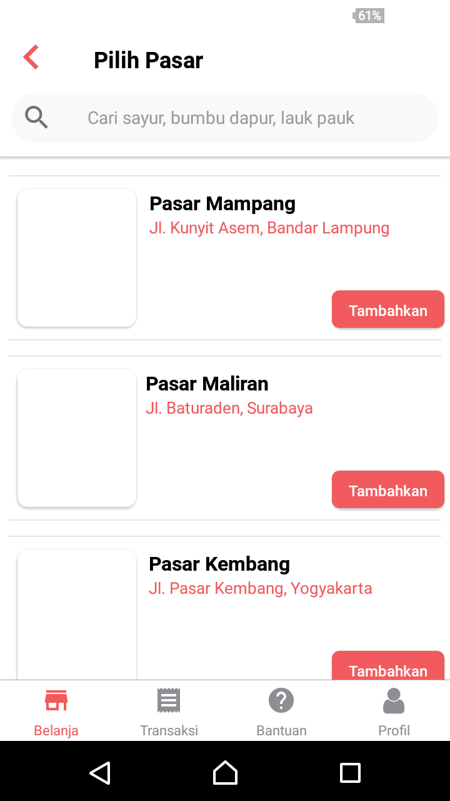
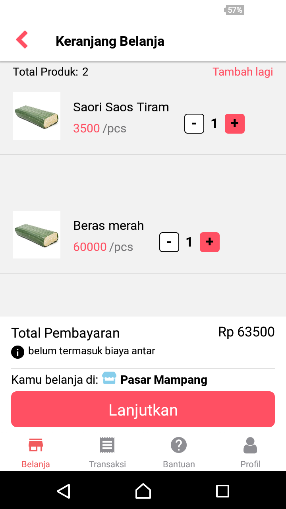
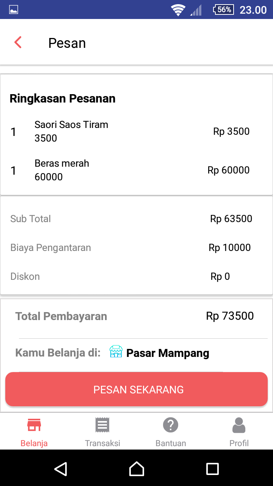
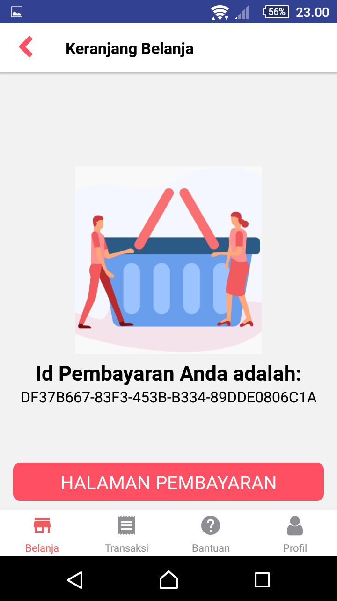
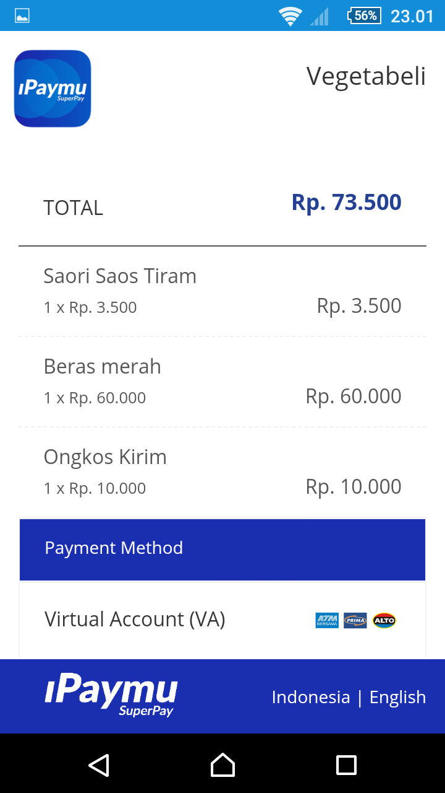

<h1 align="left">Vegetabeli</h1>

## Table of Contents

- [Introduction](#introduction)
- [Features](#features)
- [Requirements](#requirements)
- [Screenshots](#screenshots)
- [Release APK](#release-apk)
- [Contributors](#contributors)

## Introduction
<b>Vegetabeli!</b> is an online shop application that is inspired by the tumbasin.id application. In Vegetabeli there are some additional features from the previous application.

## Features
* User can Register and Login with email and password
* User can manage their profile
* User can see the items being sold
* User users can order the items

## Requirements
* [`Yarn`](https://yarnpkg.com/)
* [`react-native`](https://facebook.github.io/react-native/docs/getting-started)
* [`react-native-cli`](https://facebook.github.io/react-native/docs/getting-started)
* [`Vegetabeli`](https://github.com/massgt/RNvegetabeli)

## Screenshots

    
    
    
    
    
    
    

## Release APK

## Contributors

  <table>
    <tr>
      <td align="center">
        <a href="https://github.com/massgt">
          <b>Sigit Wijaya Pramono</b>
        </a>
      </td>
    </tr>
  </table>

